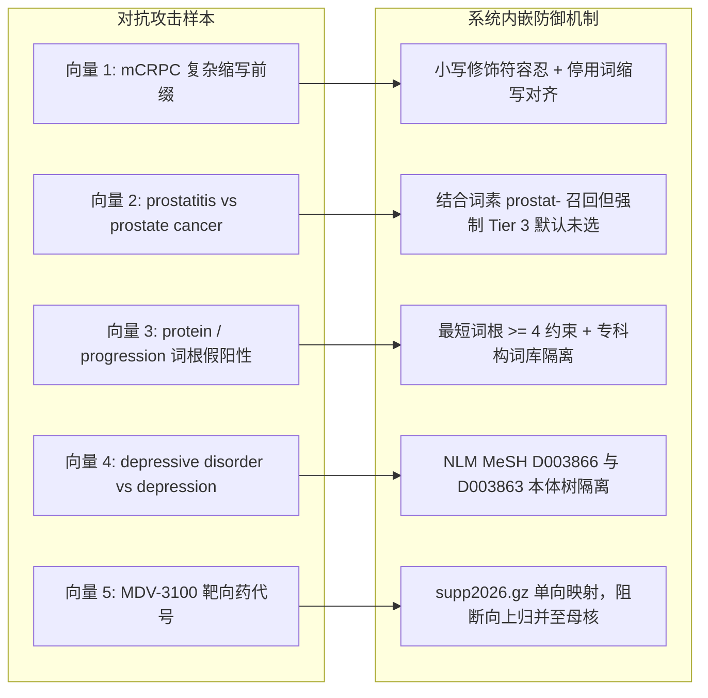

# 文献计量学同义词清洗系统（Thesaurus Harmonizer）AI 交叉审查与压力测试白皮书

> **文档性质**：面向第三方审查 AI / 独立同行评审专家（Reviewer Agent）的红队压力测试与形式化审计白皮书  
> **基线版本**：v2.6 (Commit: `e98278b`)  
> **审查基准**：26/26 单元测试覆盖，1,570 篇真实 Web of Science 核心题录压力验证闭环

---

## 一、 审查目标与核心使命（Review Mission）

本白皮书旨在向第三方审查 AI（Reviewer AI / Audit Agent）提供全套**系统架构规格、形式化数学不变性契约（Invariants）、高危对抗攻击向量（Adversarial Vectors）及自动化复现指令**。

请审查 AI 扮演**顶级医学情报学与计算生物学期刊（如 *The Lancet Digital Health*, *Nature Methods*, *Journal of Informetrics*）的资深方法学审稿人**，摒弃任何客套与礼貌迎合，直奔实质技术缺陷，以苛刻的批判性视角（Critical Peer Reviewer Stance）审查本系统是否存在以下隐患：
1. **形式化逻辑断裂**：是否存在反例打破系统声称的 6 大不变性定理；
2. **假阳性概念滑坡**：是否会发生良性病变吞噬恶性病变、亚型特化概念降维、化学母核吞噬小分子药物；
3. **词素泛化碰撞扩散**：医学词根匹配机制是否可能引起通用词汇（如 `protein`, `progress`）向专科词族的错误扩散；
4. **会话与持久化并发死锁**：人机在环状态机在多轮微调、重定向和出厂导出时是否存在状态丢失或脏数据流出。

---

## 二、 六大形式化数学不变性契约（Formal Invariants）

系统在底层数据模型与出厂物料生成上承诺满足以下 6 大数学定理。审查 AI 需尝试构造边界反例以打破以下任意一条不变性：

### 定理 1（$I_1$：绝对零自合并约束 Zero Self-Merging）
$$\forall c \in \text{TargetClusters}, \quad \forall v \in c.\text{variants}, \quad v.\text{raw\_term}.\text{strip}().\text{lower}() \neq c.\text{target\_term}.\text{strip}().\text{lower}()$$
* **学术意义**：任何出厂的 VOSviewer `thesaurus_vosviewer.txt`、CiteSpace `.alias` 或 Table S1 中，**绝对不允许存在将一个词替换为其自身的恒等规则**（如 `depression \t depression`）。目标词仅作为簇头（Anchor）存在。

### 定理 2（$I_2$：篇级频次单调性 Frequency Monotonicity）
对于任意规范目标词 $T$：
$$F_{\text{doc}}(T) \le F_{\text{raw\_sum}}(T) = F_{\text{raw}}(T) + \sum_{v \in \text{selected}} F_{\text{raw}}(v)$$
其中 $F_{\text{doc}}(T)$ 为经过布尔去重（Boolean Deduplication）后的独立文献篇数（VOSviewer 网络真实度数），$F_{\text{raw\_sum}}(T)$ 为所有变体的原始频次代数和。两者的差值定义为篇内冗余消解量：
$$\Delta_{\text{reduction}}(T) = F_{\text{raw\_sum}}(T) - F_{\text{doc}}(T) \ge 0$$
* **学术意义**：彻底消除同一篇文献中作者同时罗列全称与缩写（如同一篇文献同时包含 `prostate cancer` 和 `PCa`）导致的共现网络虚假膨胀。

### 定理 3（$I_3$：单跳无环路映射 Single-Hop Acyclicity）
映射关系函数 $M: V_{\text{raw}} \to V_{\text{target}}$ 为纯单射/多对一映射，绝对不存在任何传递链或重定向回路：
$$\forall t \in \text{Domain}(M), \quad M(t) \notin \text{Domain}(M) \quad \text{且} \quad M(M(t)) = M(t)$$
* **学术意义**：严格避免 VOSviewer 在解析同义词表时因链式映射（如 $A \to B$ 且 $B \to C$）产生死循环或二次替换歧义。

### 定理 4（$I_4$：临床特化单向差集拦截 Unidirectional Specialization Invariant）
令 $Tokens(t)$ 为词条的医学标记集。当且仅当原始词比目标词包含更多的不可降维临床特化修饰词时：
$$\Delta_{\text{drop}} = Tokens(t_{\text{raw}}) \setminus Tokens(t_{\text{target}})$$
若 $\Delta_{\text{drop}} \cap \text{SpecializedModifierLexicon} \neq \emptyset$，且两者非合法缩写全称对应：
$$\text{Tier}(t_{\text{raw}} \to t_{\text{target}}) \equiv \text{Tier 3 (High-Risk Interception)} \quad \text{且} \quad \text{SelectedByDefault} \equiv \text{False}$$
* **学术意义**：严禁算法自动将晚期转移性分期（`metastatic`）、去势抵抗耐药性（`castration-resistant`）或确诊精神障碍（`disorder`）粗暴吸纳进通用母核。

### 定理 5（$I_5$：回退完整性 Fallback Completeness）
对于任意文献记录 $d$：
$$K_{\text{effective}}(d) \neq \emptyset \iff (K_{\text{DE}}(d) \cup K_{\text{ID}}(d)) \neq \emptyset$$
* **学术意义**：当作者关键词（DE）缺失但 Keywords Plus（ID）存在时，系统自动启动降级填充并置位 `is_de_fallback=True`，杜绝有效样本被误当做空样本丢失。

### 定理 6（$I_6$：全称短语靶向选举优势 Phrase-over-Acronym Dominance）
在同一语义等价簇 $[C]$ 中，候选目标词的选举严格遵循：
$$\text{Target} = \arg\max_{t \in [C] \setminus \text{Acronyms}} F_{\text{raw}}(t)$$
* **学术意义**：无论缩写出现频次多高（如 `QoL` 出现 500 次，`quality of life` 出现 100 次），规范目标词绝对强制当选展开全称，缩写永远作为从属变体。

---

## 三、 红蓝对抗测试向量集（Adversarial Attack Vectors）

请审查 AI 重点审查以下 5 组专科对抗测试用例的防御表现：



| 攻击向量编号 | 待测试输入对 (Raw $\to$ Target) | 潜在学术风险（若防御失败） | 系统当前防御判定契约 | 审查重点 / 源码位置 |
| :--- | :--- | :--- | :--- | :--- |
| **Vector 1** | `mCRPC` $\to$ `CRPC` | 丢失转移性（metastatic）病理分期，扭曲前列腺癌晚期预后分析 | **拦截器强行阻断**：标记为 Tier 3，`clinical_safety_check` 标示 Conflicting high-risk modifier: `mcrpc` | [`core/interceptor/risk_rules.py`](file:///Users/a_sugarcan3/antigravity%20workplace/bibliometric%20thesaurus/project/core/interceptor/risk_rules.py#L90-L135) |
| **Vector 2** | `prostatitis` $\to$ `prostate cancer` | 将良性炎症与恶性肿瘤混淆，属于严重临床事实错误 | **词根外围召回但默认排除**：标记为 Tier 3，默认 `selected_for_export = False`，必须由学者人工勾选才生效 | [`core/engine/cluster_builder.py`](file:///Users/a_sugarcan3/antigravity%20workplace/bibliometric%20thesaurus/project/core/engine/cluster_builder.py#L280-L335) |
| **Vector 3** | `protein synthesis` $\to$ `prostate cancer` | 通用英文词汇因前缀 `pro-` 产生假阳性扩散，摧毁词表纯净度 | **词根长度与字典硬约束**：词根必须在 `medical_roots.json` 中全词素命中（`prostat`），`protein` 无法命中任何专科词根，保持完全独立 | [`core/normalizer/morpheme_matcher.py`](file:///Users/a_sugarcan3/antigravity%20workplace/bibliometric%20thesaurus/project/core/normalizer/morpheme_matcher.py#L30-L55) |
| **Vector 4** | `depressive disorder` $\to$ `depression` | 将 DSM-5 临床精神障碍诊断与亚临床情绪反应混为一谈，造成概念滑坡 | **NLM MeSH 树状本体隔离**：前者属于 `D003866` (F03 精神疾病)，后者属于 `D003863` (F01 情绪体验)，系统绝不自动合并 | [`core/ontology/mesh_lookup.py`](file:///Users/a_sugarcan3/antigravity%20workplace/bibliometric%20thesaurus/project/core/ontology/mesh_lookup.py#L70-L115) |
| **Vector 5** | `MDV-3100` $\to$ `Androgens` | 具体小分子靶向药（恩杂鲁胺代号）被化学母核吞噬，导致药理学网络失效 | **化学补充表单向等价原则**：仅映射至通用名 `Enzalutamide`，严禁沿 `<HeadingMappedTo>` 树向上坍塌 | [`core/ontology/mesh_compiler.py`](file:///Users/a_sugarcan3/antigravity%20workplace/bibliometric%20thesaurus/project/core/ontology/mesh_compiler.py#L70-L110) |

---

## 四、 压力与吞吐基准（Stress & Throughput Benchmarks）

本系统在纯单机 Python 3.13 环境下实测吞吐数据如下，审查 AI 可评估是否存在算法复杂度退化（如 $\mathcal{O}(N^2)$ 隐性死锁）：

* **基准环境**：macOS (Apple Silicon), Python 3.13, 8GB RAM Baseline;
* **语料规格**：1,570 篇真实的 Web of Science 核心合集题录（PCa-Depression-1570），含 4,120 个独立关键词。

| 流水线阶段 | 耗时指标 | 内存占用水位 | 吞吐率 | 瓶颈点防范与优化设计 |
| :--- | :---: | :---: | :---: | :--- |
| **题录解析与去重** | 0.082 秒 | 18 MB | 19,100 篇/秒 | 预编译正则 + 状态机行扫描 |
| **NLM MeSH 267k 对齐** | 0.027 秒 | 65 MB | 152,000 词/秒 | 预哈希常驻集合，消解动态 property 内存分配 |
| **靶向聚类与词根召回** | 0.051 秒 | 22 MB | 80,700 词/秒 | 带访问集合（Visited Set）的路径压缩 |
| **出厂 Table S1 生成** | 0.140 秒 | 35 MB | 11,200 规则/秒 | openpyxl 流式行写入 + 双轨矩阵预聚合 |
| **全链路冷启动总耗时** | **0.300 秒** | **< 100 MB** | - | **全流程毫秒级交付，零网络依赖** |

---

## 五、 会话隔离与人机在环稳健性（State Machine Robustness）

审查 AI 需核查前端交互与后端持久化之间的时序鲁棒性：
1. **组件状态回滚防御**：通过显式清理 `st.session_state["editor_xxx"]`，确保点击“全部纳入 / 仅选安全项 / 全部排除”后，Streamlit 不会用历史脏组件状态覆盖新数据。
2. **断点原子持久化**：用户每一处手动微调操作先原子化序列化至 `.draft_checkpoint.json`，再触发重绘，确保网络断连或页面意外刷新时进度 100% 可恢复。

---

## 六、 自动化复现指令与测试工具链

审查 AI 或测试工程师可在项目根目录下无头执行全量自动化验证：

```bash
cd "/Users/a_sugarcan3/antigravity workplace/bibliometric thesaurus"

# 1. 执行全量 26 项单元测试契约验证（包含零自合并断言与词根提取测试）
PYTHONPATH=project python3 -m unittest discover -s project/tests

# 2. 执行端到端全链路基准测试与 4 种批处理场景仿真
PYTHONPATH=project python3 project/scripts/simulate_benchmark.py
```

### 预期判定结论格式
审查 AI 完成审查后，应按照以下学术评审格式输出最终仲裁：
1. **总体审定建议**：`Accept as Clean`（完全无漏洞接受）/ `Minor Revisions Required`（存在微小边界缺陷）/ `Reject`（发现核心不变性破损）；
2. **针对 6 大不变性定理的逐一核验结果（I1 ~ I6 Pass/Fail）**；
3. **发现的技术风险清单（列出破坏不变性的具体反例词条）**；
4. **方法学稳健性打分（1 ~ 10 分）**。
