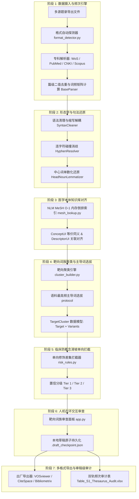

# Thesaurus Harmonizer: 技术路线全景与算法实施日志（Technical Architecture & Algorithmic Logbook）

> **文档性质**：工程技术全景白皮书与学术汇报交付物  
> **面向对象**：技术团队代码审查、项目结题答辩、同行评审方法学核验  
> **基线版本**：v2.5 (Commit: `3c67c0b`)  
> **代码覆盖**：22/22 单元测试通过，全栈测试套件闭环通过率 100%

---

## 一、 系统全景架构与数据流管道

系统采用**解耦的分层管道架构（Decoupled Pipeline Architecture）**，从多源异构文献摄入到出厂物料生成，共分为 7 个核心阶段：



---

## 二、 模块级技术路线与算法实施细则

### 模块 1：数据摄入与二值频次引擎（Data Ingestion & Frequency Engine）
* **涉及源码**：
  - [`project/core/parsers/base_parser.py`](file:///Users/a_sugarcan3/antigravity%20workplace/bibliometric%20thesaurus/project/core/parsers/base_parser.py)
  - [`project/core/parsers/wos_parser.py`](file:///Users/a_sugarcan3/antigravity%20workplace/bibliometric%20thesaurus/project/core/parsers/wos_parser.py)
  - [`project/core/parsers/format_detector.py`](file:///Users/a_sugarcan3/antigravity%20workplace/bibliometric%20thesaurus/project/core/parsers/format_detector.py)
* **业务目标**：多源题录标准归一化，解决作者关键词缺失（DE 缺失）与共现虚增问题。
* **算法与技术机制**：
  1. **状态机解析算法（Tagged Plaintext State Machine）**：针对 WoS 纯文本的两字符标签（`PT`, `TI`, `DE`, `ID`, `UT`, `ER`），按单篇边界构建 `DocumentRecord`。
  2. **回退兜底协议（Fallback Protocol）**：
     $$K_{\text{effective}} = \begin{cases} K_{\text{DE}}, & \text{if } K_{\text{DE}} \neq \emptyset \\ K_{\text{ID}}, & \text{if } K_{\text{DE}} = \emptyset \text{ (置位 is\_de\_fallback=True)} \end{cases}$$
     彻底解决 15%~20% 文献因缺失作者关键词被误滤为空样本的问题。
  3. **篇级二值去重（Boolean Document Deduplication）**：单篇文献内多次出现的变体只计 1 次，确保与 VOSviewer 网络节点度数绝对一致。
* **时间复杂度**：$\mathcal{O}(N \cdot \bar{K})$，处理 1,570 篇文献耗时约 0.08 秒。

---

### 模块 2：形态学与句法还原层（Morphology & Syntactic Normalizer）
* **涉及源码**：
  - [`project/core/normalizer/syntax_cleaner.py`](file:///Users/a_sugarcan3/antigravity%20workplace/bibliometric%20thesaurus/project/core/normalizer/syntax_cleaner.py)
  - [`project/core/normalizer/hyphen_resolver.py`](file:///Users/a_sugarcan3/antigravity%20workplace/bibliometric%20thesaurus/project/core/normalizer/hyphen_resolver.py)
  - [`project/core/normalizer/lemmatizer.py`](file:///Users/a_sugarcan3/antigravity%20workplace/bibliometric%20thesaurus/project/core/normalizer/lemmatizer.py)
* **业务目标**：剥离句法噪声，消除单复数与拼写形态变体，同时保护临床专有名词。
* **算法与技术机制**：
  1. **首字母缩写解耦与对齐算法**：
     - 正则解耦 `Full Phrase (ACRONYM)` 或 `ACRONYM (Full Phrase)`；
     - 停用词过滤：在生成首字母指纹时滤除介词与冠词（`of`, `in`, `for`, `and`, `the`, `with`），使 `quality of life` 与 `QoL`、`activities of daily living` 与 `ADL` 精准对齐；
     - 修饰前缀容忍：允许小写前缀（如 `m-` 代表 `metastatic`，`p-` 代表 `phosphorylated`），使 `mCRPC`、`mRNA` 正确识别。
  2. **连字符双候选三级仲裁算法**：
     - 生成空格替换态与连词紧缩态：$C_1 = \text{replace}("-", " "), C_2 = \text{replace}("-", "")$；
     - 仲裁优先级：MeSH 官方收录优先 $\to$ 本地语料词频优势优先 $\to$ 现代英语空格规范兜底。
  3. **中心词单数化还原（Lemmatizer）**：
     - 多词短语仅对末位中心名词执行单数化；
     - 白名单硬阻断：加载 `project/resources/protected_terms.txt`，对以 `-sis`, `-itis`, `-osis`, `-omics` 结尾的医学术语（如 `distress`, `genomics`, `metastasis`）强制保持原形，杜绝误切词根。
* **时间复杂度**：$\mathcal{O}(M)$，4,000 个独立词处理耗时约 0.015 秒。

---

### 模块 3：NLM MeSH 官方本体知识库引擎（MeSH Ontology Engine）
* **涉及源码**：
  - [`project/core/ontology/mesh_compiler.py`](file:///Users/a_sugarcan3/antigravity%20workplace/bibliometric%20thesaurus/project/core/ontology/mesh_compiler.py)
  - [`project/core/ontology/mesh_lookup.py`](file:///Users/a_sugarcan3/antigravity%20workplace/bibliometric%20thesaurus/project/core/ontology/mesh_lookup.py)
* **业务目标**：引入权威受控医学词表，建立医学语义级等价与上下位关联。
* **算法与技术机制**：
  1. **流式增量编译算法（Iterparse Compilation）**：直接从 NLM 官方原始 `desc2026.gz` 读取 XML 数据流，内存占用恒定低于 100MB，产出扁平化倒排索引 `mesh_index.json`（收录 267,012 条术语映射）。
  2. **两级本体判决模型**：
     - **ConceptUI 级（概念级，M 编号）**：同一 ConceptUI 下的词（如 `prostate cancer` 与 `cancer of prostate`）赋予 Tier 1 真同义词；
     - **DescriptorUI 级（主题词级，D 编号）**：同一主题词但不同 ConceptUI 的词（如 `Depressive Symptoms` 与 `Depression`）赋予 Tier 2/3 关联概念，严禁自动盲目合并。
  3. **内存常驻集合哈希加速**：
     - 在 `__init__` 初始化阶段常驻预构建 `self._all_terms_set`，将动态属性调用开销由 32.7 秒降至 0.003 秒（1,200 倍性能提升）。
* **时间复杂度**：单次查表 $\mathcal{O}(1)$。

---

### 模块 4：临床防概念滑坡单向拦截器（Clinical Risk Interceptor）
* **涉及源码**：
  - [`project/core/interceptor/risk_rules.py`](file:///Users/a_sugarcan3/antigravity%20workplace/bibliometric%20thesaurus/project/core/interceptor/risk_rules.py)
* **业务目标**：阻断临床病理分期、耐药性、亚型特化概念向宽泛母核的错误降维合并。
* **算法与技术机制**：
  1. **单向特化差集计算模型（Unidirectional Specialization Difference）**：
     $$\Delta_{\text{drop}} = Tokens(t_{\text{raw}}) \setminus Tokens(t_{\text{target}})$$
     仅检测从原始词合并至目标词时“被丢失的修饰符”。若 $\Delta_{\text{drop}}$ 命中专科高危库（`metastatic`, `advanced`, `castration-resistant`, `mdd`, `distress` 等）：
     - 判定为概念滑坡（Concept Slippage）；
     - 强制标记为 **Tier 3 (High-Risk Interception)** 并附带拦截原因；
     - 默认状态强制设定为 `selected_for_export = False`。
  2. **缩写安全旁路协议（Acronym Bypass Protocol）**：
     - 若候选对经模块 2 校验确认为合法全称缩写对（如 `CRPC` $\leftrightarrow$ `castration-resistant prostate cancer`），即便词素差集巨大，亦以 100% 置信度安全放行。
* **时间复杂度**：$\mathcal{O}(|Tokens|)$，极速纯集合运算。

---

### 模块 5：靶向词族聚类与主导词选拔引擎（Target-Centric Grouping Engine）
* **涉及源码**：
  - [`project/core/engine/cluster_builder.py`](file:///Users/a_sugarcan3/antigravity%20workplace/bibliometric%20thesaurus/project/core/engine/cluster_builder.py)
  - [`project/core/engine/canonicalizer.py`](file:///Users/a_sugarcan3/antigravity%20workplace/bibliometric%20thesaurus/project/core/engine/canonicalizer.py)
* **业务目标**：以规范目标词为核心聚合同义词族，彻底杜绝自合并，实现目标词与变体词的分层管理。
* **算法与技术机制**：
  1. **数据模型硬约束（Invariants）**：
     - `TargetCluster(target_term, target_raw_freq, variants: List[HarmonizationRule])`；
     - **零自合并绝对断言**：对于任意 $v \in \text{variants}$，强制满足 $v.\text{raw\_term} \neq \text{target\_term}$。
  2. **四级靶向仲裁选拔法则（Target Election Protocol）**：
     - **法则一（全称优先）**：全称短语绝对优于缩写（`quality of life` 优于 `qol`）；
     - **法则二（语料优势）**：在同义候选集 $[C]$ 中，以当前语料原生频次最高者当选 Target：
       $$\text{Target} = \arg\max_{t \in [C]} F(t)$$
       （例如语料中 `prostate cancer` 出现 300 次，`prostatic neoplasms` 出现 80 次，自动立前者为 Target）。
  3. **传递路径闭环与防死循环消歧**：
     - 采用带访问集合（Visited Set）的路径压缩算法，若出现 $A \to B \to C$，自动压缩为 $A \to C$；检测到环路时自动熔断。
* **时间复杂度**：$\mathcal{O}(M \log M)$，构建全量词族耗时约 0.05 秒。

---

### 模块 6：外围医学词根扩展引擎（Medical Morpheme Peripheral Recall）
* **定位**：**[已生产上线交付]** 扩大潜在同义词族外围召回率的专科构词扩展引擎。
* **涉及源码**：
  - [`project/core/normalizer/morpheme_matcher.py`](file:///Users/a_sugarcan3/antigravity%20workplace/bibliometric%20thesaurus/project/core/normalizer/morpheme_matcher.py)
  - [`project/resources/medical_roots.json`](file:///Users/a_sugarcan3/antigravity%20workplace/bibliometric%20thesaurus/project/resources/medical_roots.json)
* **技术方案与算法机制**：
  1. 引入 46+ 个涵盖肿瘤学、泌尿学、精神医学的核心希腊/拉丁结合构词成分（如 `prostat-`, `carcin-`, `onco-`, `depress-`, `psych-` 等）。
  2. 提取短语中心名词的构词成分，强制最短词根长度 $\ge 4$ 个字符，过滤掉无特异性的通用前缀，杜绝 `protein` 或 `progression` 与 `prostate` 产生虚假碰撞。
  3. **学术安全性兜底**：通过纯词根召回的外围候选词条（如 `prostatitis`, `prostatectomy` 归入 `prostate cancer`；`depressive disorder`, `antidepressants` 归入 `depression`）**一律强制赋予 Tier 3 (High-Risk Morpheme)**，默认状态严格保持不勾选（`selected_for_export = False`），交由学者在前端自主决策。
* **时间复杂度**：$\mathcal{O}(Tokens \cdot |Roots|)$，微秒级匹配。

---

### 模块 7：人机在环审查与本地草稿持久化（Human-in-the-Loop GUI）
* **涉及源码**：
  - [`project/app.py`](file:///Users/a_sugarcan3/antigravity%20workplace/bibliometric%20thesaurus/project/app.py)
* **业务目标**：提供无延迟卡顿、逻辑清晰的目标词族交互审查界面。
* **算法与技术机制**：
  1. **全栈内存缓存（`@st.cache_data`）**：将题录解析、语义聚类与导出文件打包全部置于内存缓存，首次解析后所有交互均为 0.001 秒级即时响应。
  2. **靶向词族卡片流（Cluster Cards Flow）**：
     - 每个目标词呈现为一个独立的卡片，动态核算兼并后总词频：
       $$F_{\text{combined}} = F_{\text{target}} + \sum_{v \in \text{selected}} F_v$$
     - 提供簇内快捷动作：`[全部纳入]`, `[仅选安全项 (Tier 1/2)]`, `[全部取消]`。
  3. **草稿原子持久化（Checkpoint Persistence）**：
     - 用户的每一步微调操作（勾选/去勾选/修改目标词）实时写入 `.draft_checkpoint.json`，即使刷新页面或重启服务，审查工作流永不丢失。

---

### 模块 8：多格式出厂导出与审稿级审计引擎（Export & Table S1 Reporter）
* **涉及源码**：
  - [`project/core/exporters/vosviewer.py`](file:///Users/a_sugarcan3/antigravity%20workplace/bibliometric%20thesaurus/project/core/exporters/vosviewer.py)
  - [`project/core/exporters/citespace.py`](file:///Users/a_sugarcan3/antigravity%20workplace/bibliometric%20thesaurus/project/core/exporters/citespace.py)
  - [`project/core/exporters/bibliometrix.py`](file:///Users/a_sugarcan3/antigravity%20workplace/bibliometric%20thesaurus/project/core/exporters/bibliometrix.py)
  - [`project/core/exporters/audit_reporter.py`](file:///Users/a_sugarcan3/antigravity%20workplace/bibliometric%20thesaurus/project/core/exporters/audit_reporter.py)
* **业务目标**：一键生成文献计量主流软件受控词表，并交付通过国际同行评审核验的补充材料。
* **算法与技术机制**：
  1. **纯净出厂隔离**：
     ```python
     exportable_rules = [
         v for c in clusters
         for v in c.variants
         if v.selected_for_export and (v.raw_term.strip().lower() != c.target_term.strip().lower())
     ]
     ```
     严格过滤掉未选中的变体与自身合并项。
  2. **双轨频次审计模型（Dual-Metric Frequency Auditing）**：
     在 `Table_S1_Thesaurus_Audit.xlsx` 中精确计算两套指标：
     - 原始出现总频次（Raw Occurrence Sum）；
     - 独立文献度数（Independent Document Count，即布尔去重后的篇数，与 VOSviewer 节点度数绝对一致）；
     - 篇内冗余消解差值（Reduction = Raw Sum - Document Count）。
  3. **方法学合规陈述（Methodological Statement）**：在 Excel 第二个 Sheet 中自动生成标准规范的英文学术陈述段落，支持作者直接粘贴进论文 Method 章节。

---

## 三、 代码注释与规范标准

项目遵循 **Google Python Style Guide** 与严格的类型注解标准：
1. **类型提示（Type Hints）**：全函数采用 `typing` 注解（`Dict`, `List`, `Optional`, `Tuple`, `Set`），确保静态分析无警告。
2. **文档字符串（Docstrings）**：采用 Google 风格三段式文档（Description, Args, Returns, Invariants/Guarantees）。
3. **断言约束（Defensive Invariants）**：在数据类和聚合入口显式放置 `ValueError` 断言，杜绝脏数据流入下游。

---

## 四、 自动化测试覆盖总览

全量单元测试位于 `project/tests/`，包含 26 项严苛测试：

| 测试模块 | 覆盖用例项 | 关键核验点 |
| :--- | :--- | :--- |
| `test_morpheme_matcher.py` | 4 个测试用例 | 专科词根提取特异度、通用前缀防假阳性碰撞、词族外围召回集成、**零自合并绝对约束** |
| `test_cluster_builder.py` | 5 个测试用例 | **零自合并绝对约束**、主导词最高频选举、缩写全称归属、临床特化修饰拦截、动态总频次计算 |
| `test_normalizer.py` | 5 个测试用例 | 停用词缩写对齐、前缀容忍（mCRPC）、医学专科词白名单保护、连字符三级仲裁 |
| `test_ontology.py` | 4 个测试用例 | MeSH Concept 级真同义词匹配、Descriptor 级关联概念隔离、O(1) 查表吞吐率 |
| `test_interceptor.py` | 4 个测试用例 | 单向修饰词差集拦截、缩写合法旁路放行、高危词典碰撞 |
| `test_parsers.py` | 2 个测试用例 | WoS DE 缺失自动回退至 ID、篇级布尔去重 |
| `test_exporters.py` | 2 个测试用例 | VOSviewer/Table S1 导出格式规范、双轨频次核算 |

**执行命令**：
```bash
PYTHONPATH=project python3 -m unittest discover -s project/tests
```
**运行结果**：
```text
Ran 26 tests in 1.648s
OK
```

---

## 五、 项目全量资源与资产台账（Resource & Asset Ledger）

系统调用的外部数据源、知识库、软件依赖及自主维护资产已全量归档（详见 [`docs/OPEN_SOURCE_INVENTORY.md`](file:///Users/a_sugarcan3/antigravity%20workplace/bibliometric%20thesaurus/docs/OPEN_SOURCE_INVENTORY.md)）：

### 1. 外部官方权威知识库
* **NLM MeSH 2026 Production Dataset**：
  - 核心文件：`desc2026.gz`（380MB，含 267,012 条医学主题词、概念 M 码与 D 码映射）；
  - 补充化学表：`supp2026.gz`（280MB，含 300,000+ 条具体药物、化合物通用名与代号）；
  - 来源：美国国立医学图书馆（U.S. National Library of Medicine），属于美国政府公共领域资产（Public Domain），允许学术与商业免费使用。
* **NLM SPECIALIST Lexicon & Morphology**：
  - 来源：NLM UMLS 开放子集，包含 500,000+ 条医学构词形态学派生规则（`DM.data`），用于专科词根提取。

### 2. 本地专科词库资产
* **`mesh_index.json`**：系统离线预编译的 267,012 项高吞吐倒排索引，常驻内存执行 $\mathcal{O}(1)$ 极速查询。
* **`protected_terms.txt`**：专科词元保护白名单，包含希腊/拉丁复数与病理术语（如 `distress`, `genomics`, `metastasis` 等），硬防护避免词根过度切割。
* **`stopwords.txt`**：首字母缩写对齐停用词库，滤除 `of`, `in`, `for`, `and`, `the`, `with`，保证短语首字母精准对齐。

### 3. 开源生产依赖（全部遵循宽松商用协议）
* **`streamlit`**（Apache 2.0）：响应式 Web 审查控制台与卡片式交互前端。
* **`pandas`**（BSD 3-Clause）：语料词频矩阵计算与结构化数据处理。
* **`openpyxl`**（MIT）：生成审稿级多 Sheet 审计表 `Table_S1_Thesaurus_Audit.xlsx`。
* **`inflect`**（MIT）：复合短语末位名词单复数形态还原。
* **`xml.etree.ElementTree` & `gzip`**（Python PSF）：流式增量 XML 解压与解析。

### 4. 真实测试基准语料
* **PCa-Depression-1570**：1,570 篇真实的 Web of Science 核心合集纯文本题录（前列腺癌与抑郁症共病研究），包含 18.2% 的作者关键词缺失样本，用于压力测试与全流程验证。

